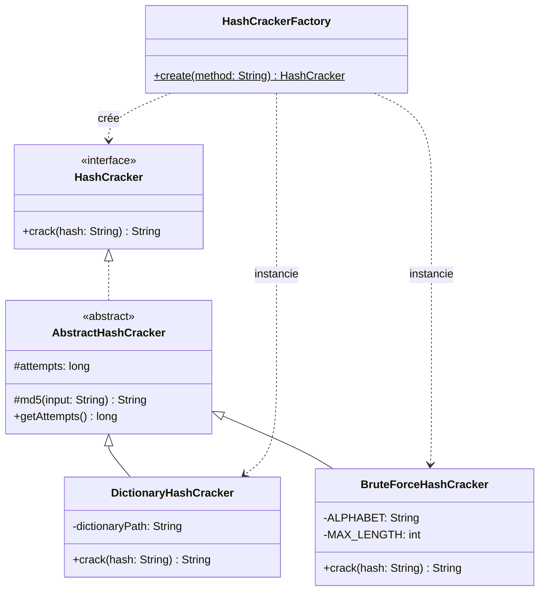

# PasswordCracker v1 — Patron *Simple Factory*

> Mini-Projet 1 — Outil de cassage de hash MD5 par **dictionnaire** ou **force brute**,
> conçu autour du patron de création **Simple Factory**.

---

## 1. Introduction

Dans le domaine de la cybersécurité, les mots de passe ne sont jamais stockés en clair :
ils sont transformés par une **fonction de hachage cryptographique** (ici MD5). Lors d'un
audit, on peut vouloir évaluer la robustesse d'un mot de passe en tentant de le retrouver
à partir de son empreinte.

`PasswordCracker` est un outil en ligne de commande qui retrouve un mot de passe à partir
de son hash MD5, selon deux stratégies au choix. L'objectif pédagogique du projet n'est pas
la performance du cassage mais la **conception orientée objet** : mettre en œuvre le patron
*Simple Factory*, le polymorphisme et une architecture modulaire.

---

## 2. Présentation du problème

L'outil reçoit deux informations et retourne le mot de passe correspondant :

| Paramètre | Rôle | Valeurs |
|-----------|------|---------|
| `-m` | Méthode de cassage | `BRUTE` (force brute) ou `DICO` (dictionnaire) |
| `-h` | Empreinte MD5 recherchée | 32 caractères hexadécimaux |

**Exemples :**

```bash
passwordCracker -m BRUTE -h c47d187067c6cf953245f128b5fde62a
passwordCracker -m DICO  -h 098f6bcd4621d373cade4e832627b4f6
```

Deux stratégies de recherche sont attendues :

- **Dictionnaire** — pour chaque mot d'une liste : calculer son MD5, le comparer au hash
  recherché, retourner le mot en cas de correspondance.
- **Force brute** — générer toutes les combinaisons de l'alphabet `a…z` jusqu'à une
  longueur maximale de **4 caractères**, dans l'ordre `a, b, … z, aa, ab, … zzzz`, et les
  tester une à une.

---

## 3. Architecture

Le projet applique le principe **« programmer vers une interface, pas vers une
implémentation »**. Le programme principal ne dépend que de l'abstraction `HashCracker` ;
il ignore totalement quelle classe concrète effectue le travail.

```
src/cracker/
├── HashCracker.java          (interface)      → le contrat commun : crack(hash)
├── AbstractHashCracker.java  (classe abstraite)→ code mutualisé : MD5 + compteur
├── DictionaryHashCracker.java(stratégie)      → recherche par dictionnaire
├── BruteForceHashCracker.java(stratégie)      → recherche exhaustive
├── HashCrackerFactory.java   (fabrique)       → crée la bonne stratégie
└── Main.java                 (application)    → CLI passwordCracker
```

### Responsabilités des classes

| Classe | Responsabilité |
|--------|----------------|
| **`HashCracker`** *(interface)* | Définit le contrat unique `String crack(String hash)`. Retourne le mot de passe trouvé, ou `null`. C'est le *produit abstrait* de la fabrique. |
| **`AbstractHashCracker`** *(abstraite)* | Factorise le code commun aux stratégies : calcul de l'empreinte MD5 (`md5`) et compteur de tentatives (`getAttempts`). Respecte la contrainte « éviter les duplications de code » (principe **DRY**). |
| **`DictionaryHashCracker`** | Stratégie concrète : parcourt un fichier dictionnaire, hache chaque mot et compare au hash cible. |
| **`BruteForceHashCracker`** | Stratégie concrète : génère récursivement toutes les combinaisons `a-z` (longueur ≤ 4) et les teste. |
| **`HashCrackerFactory`** | **Fabrique simple** : centralise la création des stratégies à partir d'une chaîne (`"BRUTE"` / `"DICO"`). Seul point du code qui utilise `new` sur les classes concrètes. |
| **`Main`** | Application console : analyse les arguments `-m`/`-h`, délègue la création à la fabrique, mesure le temps et le nombre de tentatives, affiche le résultat. |

> **Choix de conception.** Le cahier de charge que vous nous aviez donné impose l'interface `HashCracker` et les deux stratégies .
> Nous avons ajouté la classe abstraite `AbstractHashCracker` **entre** l'interface et les
> stratégies pour mutualiser le calcul MD5 (identique dans les deux stratégies) et le
> compteur de tentatives. La fabrique continue de renvoyer le type `HashCracker`, l'énoncé
> est donc respecté.

---

## 4. Diagramme UML



---

## 5. Usage du patron *Simple Factory*

### Principe

Le patron **Simple Factory** consiste à **déléguer la création des objets à une classe
dédiée** (la fabrique), au lieu de disséminer les `new` dans tout le code client. Le client
demande un produit par un identifiant ; la fabrique décide de la classe concrète à
instancier.

### Mise en œuvre

La fabrique expose une méthode statique unique :

```java
public static HashCracker create(String method) {
    switch (method.trim().toUpperCase()) {
        case "BRUTE": return new BruteForceHashCracker();
        case "DICO":  return new DictionaryHashCracker();
        default:      throw new IllegalArgumentException("Méthode inconnue : " + method);
    }
}
```

Côté client (`Main`), **aucune** classe concrète n'est instanciée directement :

```java
HashCracker cracker = HashCrackerFactory.create(method); // on ne sait pas laquelle
String result = cracker.crack(hash);                     // polymorphisme
```

### Ce que le patron apporte ici

- **Découplage** : `Main` dépend de l'interface `HashCracker`, pas des stratégies.
- **Centralisation** : toute la logique « quelle classe créer » est à un seul endroit.
- **Polymorphisme** : `crack()` est appelée sans savoir quelle stratégie s'exécute.
- **Respect des contraintes de l'énoncé** : les classes concrètes ne sont jamais
  instanciées dans le programme principal.

---

## 6. Résultats obtenus

> 🎥 **Vidéo de démonstration (≤ 10 min)** : _`https://youtu.be/1HGSZ6bz7MY?si=Zkl0pn2ysHdYG05G`_

Tests réalisés avec de **vrais** hash MD5.

| # | Commande | Résultat | Tentatives | Temps |
|---|----------|----------|-----------:|------:|
| 1 | `-m DICO -h 098f6bcd4621d373cade4e832627b4f6` | `Password found: test` | 6 | ~50 ms |
| 2 | `-m DICO -h 21232f297a57a5a743894a0e4a801fc3` | `Password found: admin` | 3 | ~55 ms |
| 3 | `-m BRUTE -h c47d187067c6cf953245f128b5fde62a` | `Password found: word` | 414 860 | ~3,8 s |
| 4 | `-m DICO -h ab4f63f9ac65152575886860dde480a1` | `Password found: azerty` | 5 | ~57 ms |
| 5 | `-m DICO -h ffffffffffffffffffffffffffffffff` | `Password not found` | 20 | ~70 ms |
| 6 | `-m XYZ  -h 098f6bcd…` | `Erreur : Méthode inconnue` | — | — |

**Exemple de sortie complète :**

```
$ ./passwordCracker -m BRUTE -h c47d187067c6cf953245f128b5fde62a
Méthode  : BRUTE
Hash     : c47d187067c6cf953245f128b5fde62a
Recherche en cours...
------------------------------------------
Password found: word
Tentatives : 414860
Temps      : 3792 ms
```

**Observations :**

- Le dictionnaire est quasi instantané mais limité aux mots qu'il contient.
- La force brute est exhaustive mais son coût explose avec la longueur : `word` (4 lettres)
  demande déjà ~415 000 essais. Cela illustre concrètement la limite d'une attaque par
  force brute et l'intérêt d'un mot de passe long.
- Le cas #4 (`azerty`, 6 lettres) montre l'utilité d'avoir plusieurs stratégies : ce mot
  est hors de portée du brute force (limité à 4 caractères) mais trouvé instantanément par
  le dictionnaire.

---

## 7. Difficultés rencontrées

- **Éviter la duplication de code.** Le calcul MD5 était identique dans les deux stratégies.
  Solution : l'extraire dans la classe abstraite `AbstractHashCracker` (principe DRY).
- **Récupérer les statistiques (tentatives) sans polluer l'interface.** L'interface imposée
  ne contient que `crack`. Le compteur a donc été placé dans la classe abstraite, exposé par
  `getAttempts()`, et lu dans `Main` via un test `instanceof`.
- **Génération ordonnée des combinaisons en force brute.** Une génération récursive par
  longueur croissante (1 → 4) produit l'ordre attendu `a, b … aa, ab …` proprement.
- **Encodage de la console.** Les accents s'affichaient mal selon le terminal ; forcer la
  sortie en UTF-8 dans `Main` a réglé le problème (utile notamment sous Windows).

---

## 8. Conclusion

Ce projet met en œuvre une architecture orientée objet propre reposant sur le patron
**Simple Factory**. Le programme principal est totalement découplé des stratégies concrètes :
il ne connaît que l'interface `HashCracker` et laisse la fabrique décider de
l'implémentation. Le polymorphisme rend l'ajout d'une stratégie transparent pour le client.

La principale **limite** apparaît clairement : ajouter une nouvelle stratégie oblige à
**modifier** la fabrique (nouveau `case`), ce qui viole le principe **Open/Closed**. Cette
limite sera corrigée dans le mini-projet suivant (par exemple via une *Factory Method* ou un
enregistrement dynamique des stratégies).

---

## Annexe — Questions de réflexion

**1. Quels avantages apporte la fabrique simple ?**
Elle centralise la création des objets en un seul endroit, découple le code client des
classes concrètes, supprime les `new` dispersés, facilite la maintenance et rend le client
polymorphe (il manipule uniquement l'interface).

**2. Quels sont ses inconvénients ?**
La fabrique doit être **modifiée** à chaque nouvelle stratégie (elle n'est pas fermée à la
modification). La méthode `create` peut devenir un long `switch` difficile à maintenir. La
logique de sélection reste concentrée dans une seule classe, qui grossit avec le temps.

**3. Que faut-il modifier lorsqu'une nouvelle stratégie est ajoutée ?**
Deux choses : (a) créer la nouvelle classe de stratégie (qui étend `AbstractHashCracker`),
et (b) **ajouter un `case`** correspondant dans `HashCrackerFactory.create`. Le code client
(`Main`), lui, n'est pas touché.

**4. La fabrique respecte-t-elle le principe Open/Closed ?**
**Non.** Le principe Open/Closed demande qu'une classe soit *ouverte à l'extension mais
fermée à la modification*. Or, ajouter une stratégie impose de **modifier** le code source
de la fabrique. On peut s'en approcher avec des patrons plus évolués (Factory Method,
Abstract Factory, ou enregistrement dynamique des stratégies) — ce sera l'objet du mini-projet
suivant.

---
